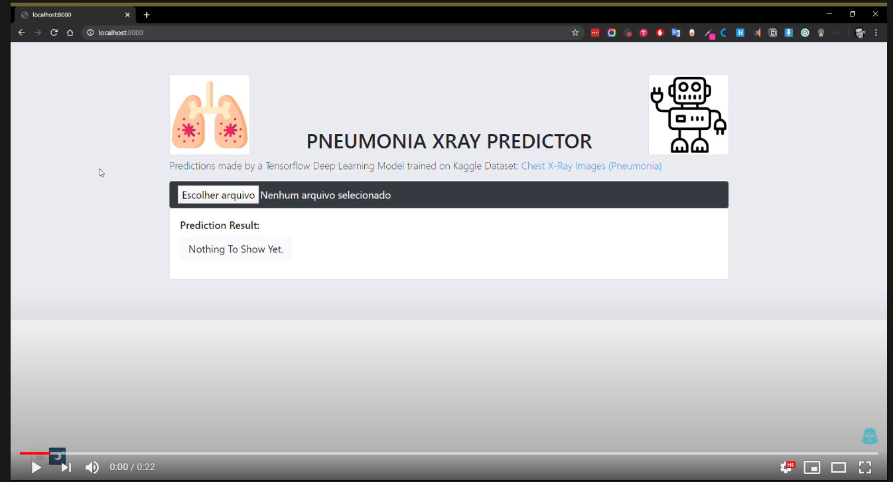

# Pneumonia Predictor
### Predictions made by a Tensorflow Deep Learning Model trained on Kaggle Dataset: Chest X-Ray Images (Pneumonia)
https://www.kaggle.com/paultimothymooney/chest-xray-pneumonia

## Run the web app
Start a simple HTTP server on port 8000 from the directory with the index.html file: 
If you have Node.js, install the http-server package globally and run: 
http-server -p 8000 
Open http://localhost:8000  

## Demo

